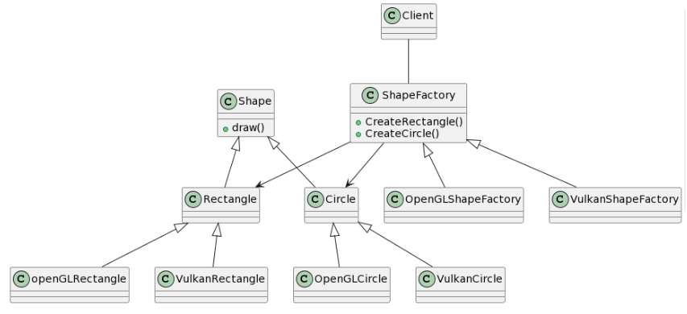

## Abstract Factory Design Pattern
### Intent
* Provide an interface for creating families of related or dependent objects without specifying their concrete classes.
* A hierarchy that encapsulates: many possible "platforms", and the construction of a suite of "products".
* The new operator considered harmful.
### Problem
If an application is to be portable, it needs to encapsulate platform dependencies. These "platforms" might include: windowing system, operating system, database, etc. Too often, this encapsulation is not engineered in advance, and lots of #ifdef case statements with options for all currently supported platforms begin to procreate like rabbits throughout the code.
### Check list
* Decide if "platform independence" and creation services are the current source of pain.
* Map out a matrix of "platforms" versus "products".
* Define a factory interface that consists of a factory method per product.
* Define a factory derived class for each platform that encapsulates all references to the new operator.
* The client should retire all references to new, and use the factory methods to create the product objects.

