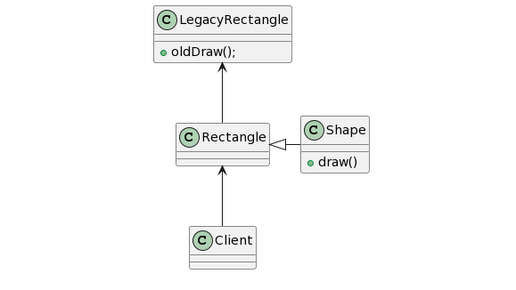

## Adapter Design Pattern
### Intent
* Convert the interface of a class into another interface clients expect. Adapter lets classes work together that couldn't otherwise because of incompatible interfaces.
* Wrap an existing class with a new interface.
* Impedance match an old component to a new system
### Problem
An "off the shelf" component offers compelling functionality that you would like to reuse, but its "view of the world" is not compatible with the philosophy and architecture of the system currently being developed.
### Check list
* Identify the players: the component(s) that want to be accommodated (i.e. the client), and the component that needs to adapt (i.e. the adaptee).
* Identify the interface that the client requires.
* Design a "wrapper" class that can "impedance match" the adaptee to the client.
* The adapter/wrapper class "has a" instance of the adaptee class.
* The adapter/wrapper class "maps" the client interface to the adaptee interface.
* The client uses (is coupled to) the new interface

