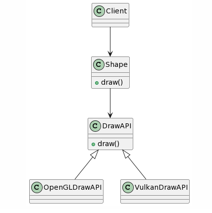

## Bridge Design Pattern
### Intent
* Decouple an abstraction from its implementation so that the two can vary independently.
* Publish interface in an inheritance hierarchy, and bury implementation in its own inheritance hierarchy.
* Beyond encapsulation, to insulation
### Problem
"Hardening of the software arteries" has occurred by using subclassing of an abstract base class to provide alternative implementations. This locks in compile-time binding between interface and implementation. The abstraction and implementation cannot be independently extended or composed.
### Check list
* Decide if two orthogonal dimensions exist in the domain. These independent concepts could be: abstraction/platform, or domain/infrastructure, or front-end/back-end, or interface/implementation.
* Design the separation of concerns: what does the client want, and what do the platforms provide.
* Design a platform-oriented interface that is minimal, necessary, and sufficient. Its goal is to decouple the abstraction from the platform.
* Define a derived class of that interface for each platform.
* Create the abstraction base class that "has a" platform object and delegates the platform-oriented functionality to it.
* Define specializations of the abstraction class if desired.

