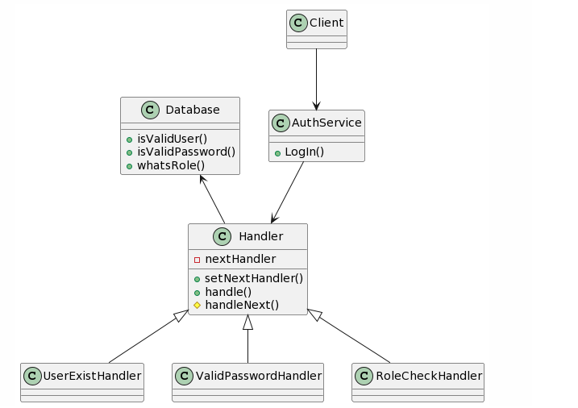

## Chain of Responsibility
### Intent
* Avoid coupling the sender of a request to its receiver by giving more than one object a chance to handle the request. Chain the receiving objects and pass the request along the chain until an object handles it.
* Launch-and-leave requests with a single processing pipeline that contains many possible handlers.
* An object-oriented linked list with recursive traversal.
### Problem
There is a potentially variable number of "handler" or "processing element" or "node" objects, and a stream of requests that must be handled. Need to efficiently process the requests without hard-wiring handler relationships and precedence, or request-to-handler mappings.
### Check list
* The base class maintains a "next" pointer.
* Each derived class implements its contribution for handling the request.
* If the request needs to be "passed on", then the derived class "calls back" to the base class, which delegates to the "next" pointer.
* The client (or some third party) creates and links the chain (which may include a link from the last node to the root node).
* The client "launches and leaves" each request with the root of the chain.
* Recursive delegation produces the illusion of magic.

  
  
