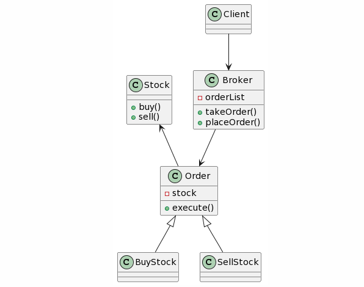

## Command Design Pattern
### Intent
* Encapsulate a request as an object, thereby letting you parametrize clients with different requests, queue or log requests, and support undoable operations.
* Promote "invocation of a method on an object" to full object status
* An object-oriented callback
### Problem
Need to issue requests to objects without knowing anything about the operation being requested or the receiver of the request.
### Check list
* Define a Command interface with a method signature like execute().
* Create one or more derived classes that encapsulate some subset of the following: a "receiver" object, the method to invoke, the arguments to pass.
* Instantiate a Command object for each deferred execution request.
* Pass the Command object from the creator (aka sender) to the invoker (aka receiver).
* The invoker decides when to execute().

  
  
