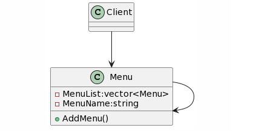

## Composite Design Pattern
### Intent
* Compose objects into tree structures to represent whole-part hierarchies. Composite lets clients treat individual objects and compositions of objects uniformly.
* Recursive composition
* "Directories contain entries, each of which could be a directory."
* 1-to-many "has a" up the "is a" hierarchy
### Problem
Application needs to manipulate a hierarchical collection of "primitive" and "composite" objects. Processing of a primitive object is handled one way, and processing of a composite object is handled differently. Having to query the "type" of each object before attempting to process it is not desirable.
### Check list
* Ensure that your problem is about representing "whole-part" hierarchical relationships.
* Consider the heuristic, "Containers that contain containees, each of which could be a container." For example, "Assemblies that contain components, each of which could be an assembly." Divide your domain concepts into container classes, and containee classes.
* Create a "lowest common denominator" interface that makes your containers and containees interchangeable. It should specify the behavior that needs to be exercised uniformly across all containee and container objects.
* All container and containee classes declare an "is a" relationship to the interface.
* All container classes declare a one-to-many "has a" relationship to the interface.
* Container classes leverage polymorphism to delegate to their containee objects.
* Child management methods [e.g. addChild(), removeChild()] should normally be defined in the Composite class. Unfortunately, the desire to treat Leaf and Composite objects uniformly may require that these methods be promoted to the abstract Component class. See the Gang of Four for a discussion of these "safety" versus "transparency" trade-offs.

  
  
