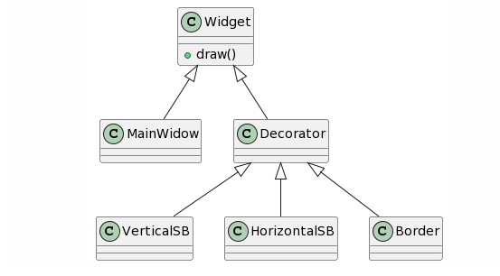

## Decorator Design Pattern
### Intent
* Attach additional responsibilities to an object dynamically. Decorators provide a flexible alternative to subclassing for extending functionality.
* Client-specified embellishment of a core object by recursively wrapping it.
* Wrapping a gift, putting it in a box, and wrapping the box.
### Problem
You want to add behavior or state to individual objects at run-time. Inheritance is not feasible because it is static and applies to an entire class.
### Check list
* Ensure the context is: a single core (or non-optional) component, several optional embellishments or wrappers, and an interface that is common to all.
* Create a "Lowest Common Denominator" interface that makes all classes interchangeable.
* Create a second level base class (Decorator) to support the optional wrapper classes.
* The Core class and Decorator class inherit from the Widget interface.
* The Decorator class declares a composition relationship to the Widget interface, and this data member is initialized in its constructor.
* The Decorator class delegates to the Widget object.
* Define a Decorator derived class for each optional embellishment.
* Decorator derived classes implement their wrapper functionality - and - delegate to the Decorator base class.
* The client configures the type and ordering of Core and Decorator objects.

  
