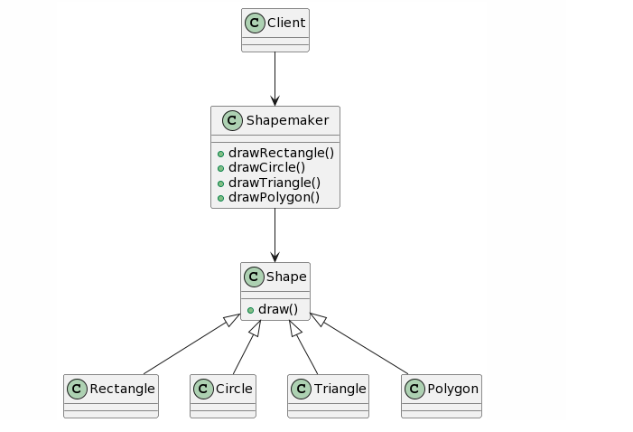

## Facade Design Pattern
### Intent
* Provide a unified interface to a set of interfaces in a subsystem. Facade defines a higher-level interface that makes the subsystem easier to use.
* Wrap a complicated subsystem with a simpler interface.
### Problem
A segment of the client community needs a simplified interface to the overall functionality of a complex subsystem.
### Check list
* Identify a simpler, unified interface for the subsystem or component.
* Design a 'wrapper' class that encapsulates the subsystem.
* The facade/wrapper captures the complexity and collaborations of the component, and delegates to the appropriate methods.
* The client uses (is coupled to) the Facade only.
* Consider whether additional Facades would add value.

  
  
