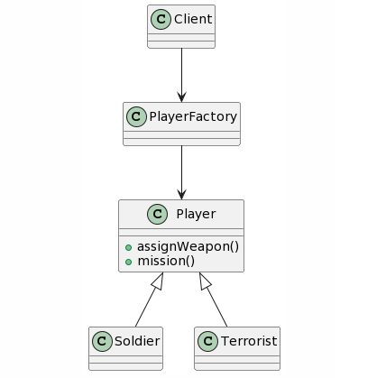

## Flyweight Design Pattern
### Intent
* Use sharing to support large numbers of fine-grained objects efficiently.
* The Motif GUI strategy of replacing heavy-weight widgets with light-weight gadgets.
### Problem
Designing objects down to the lowest levels of system "granularity" provides optimal flexibility, but can be unacceptably expensive in terms of performance and memory usage.
### Check list
* Ensure that object overhead is an issue needing attention, and, the client of the class is able and willing to absorb responsibility realignment.
* Divide the target class's state into: shareable (intrinsic) state, and non-shareable (extrinsic) state.
* Remove the non-shareable state from the class attributes, and add it the calling argument list of affected methods.
* Create a Factory that can cache and reuse existing class instances.
* The client must use the Factory instead of the new operator to request objects.
* The client (or a third party) must look-up or compute the non-shareable state, and supply that state to class methods.

