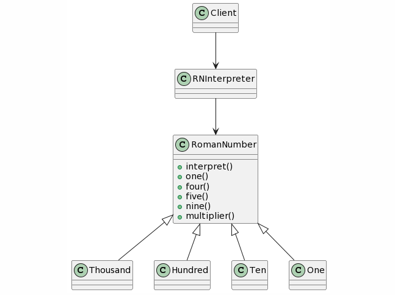

## Interpreter Design Pattern
### Intent
* Given a language, define a representation for its grammar along with an interpreter that uses the representation to interpret sentences in the language.
* Map a domain to a language, the language to a grammar, and the grammar to a hierarchical object-oriented design.
### Problem
A class of problems occurs repeatedly in a well-defined and well-understood domain. If the domain were characterized with a "language", then problems could be easily solved with an interpretation "engine".
### Check list
* Decide if a "little language" offers a justifiable return on investment.
* Define a grammar for the language.
* Map each production in the grammar to a class.
* Organize the suite of classes into the structure of the Composite pattern.
* Define an interpret(Context) method in the Composite hierarchy.
* The Context object encapsulates the current state of the input and output as the former is parsed and the latter is accumulated. It is manipulated by each grammar class as the "interpreting" process transforms the input into the output.

