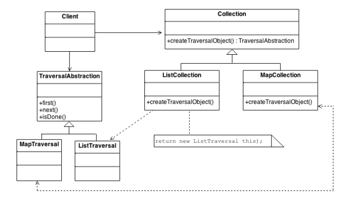

## Iterator Design Pattern
### Intent
* Provide a way to access the elements of an aggregate object sequentially without exposing its underlying representation.
* The C++ and Java standard library abstraction that makes it possible to decouple collection classes and algorithms.
* Promote to "full object status" the traversal of a collection.
* Polymorphic traversal
### Problem
Need to "abstract" the traversal of wildly different data structures so that algorithms can be defined that are capable of interfacing with each transparently.
### Check list
* Add a create_iterator() method to the "collection" class, and grant the "iterator" class privileged access.
* Design an "iterator" class that can encapsulate traversal of the "collection" class.
* Clients ask the collection object to create an iterator object.
* Clients use the first(), is_done(), next(), and current_item() protocol to access the elements of the collection class.

