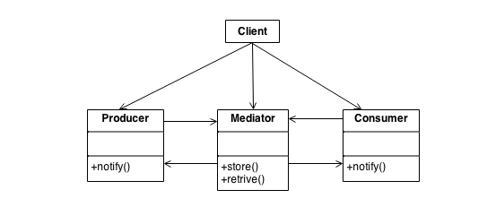

## Mediator Design Pattern
### Intent
* Define an object that encapsulates how a set of objects interact. Mediator promotes loose coupling by keeping objects from referring to each other explicitly, and it lets you vary their interaction independently.
* Design an intermediary to decouple many peers.
* Promote the many-to-many relationships between interacting peers to "full object status".
### Problem
We want to design reusable components, but dependencies between the potentially reusable pieces demonstrates the "spaghetti code" phenomenon (trying to scoop a single serving results in an "all or nothing clump").
### Check list
* Identify a collection of interacting objects that would benefit from mutual decoupling.
* Encapsulate those interactions in the abstraction of a new class.
* Create an instance of that new class and rework all "peer" objects to interact with the Mediator only.
* Balance the principle of decoupling with the principle of distributing responsibility evenly.
* Be careful not to create a "controller" or "god" object.

