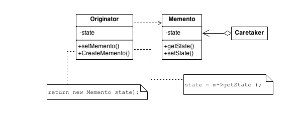

## Memento Design Pattern
### Intent
* Without violating encapsulation, capture and externalize an object's internal state so that the object can be returned to this state later.
* A magic cookie that encapsulates a "check point" capability.
* Promote undo or rollback to full object status.
### Problem
Need to restore an object back to its previous state (e.g. "undo" or "rollback" operations).
### Check list
* Identify the roles of “caretaker” and “originator”.
* Create a Memento class and declare the originator a friend.
* Caretaker knows when to "check point" the originator.
* Originator creates a Memento and copies its state to that Memento.
* Caretaker holds on to (but cannot peek into) the Memento.
* Caretaker knows when to "roll back" the originator.
* Originator reinstates itself using the saved state in the Memento.

