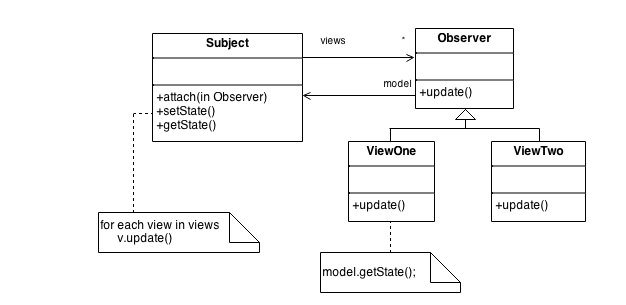

## Observer Design Pattern
### Intent
* Define a one-to-many dependency between objects so that when one object changes state, all its dependents are notified and updated automatically.
* Encapsulate the core (or common or engine) components in a Subject abstraction, and the variable (or optional or user interface) components in an Observer hierarchy.
* The "View" part of Model-View-Controller.
### Problem
A large monolithic design does not scale well as new graphing or monitoring requirements are levied.
### Check list
* Differentiate between the core (or independent) functionality and the optional (or dependent) functionality.
* Model the independent functionality with a "subject" abstraction.
* Model the dependent functionality with an "observer" hierarchy.
* The Subject is coupled only to the Observer base class.
* The client configures the number and type of Observers.
* Observers register themselves with the Subject.
* The Subject broadcasts events to all registered Observers.
* The Subject may "push" information at the Observers, or, the Observers may "pull" the information they need from the Subject.

