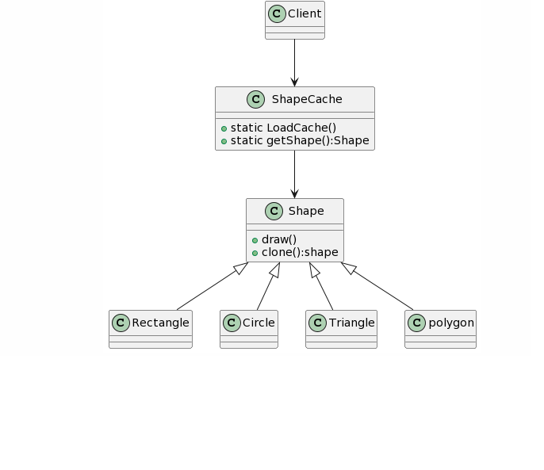

## Prototype Design Pattern
### Intent
* Specify the kinds of objects to create using a prototypical instance, and create new objects by copying this prototype.
* Co-opt one instance of a class for use as a breeder of all future instances.
* The new operator considered harmful.
### Problem
Application "hard wires" the class of object to create in each "new" expression.
### Check list
* Add a clone() method to the existing "product" hierarchy.
* Design a "registry" that maintains a cache of prototypical objects. The registry could be encapsulated in a new Factory class, or in the base class of the "product" hierarchy.
* Design a factory method that: may (or may not) accept arguments, finds the correct prototype object, calls clone() on that object, and returns the result.
* The client replaces all references to the new operator with calls to the factory method.

