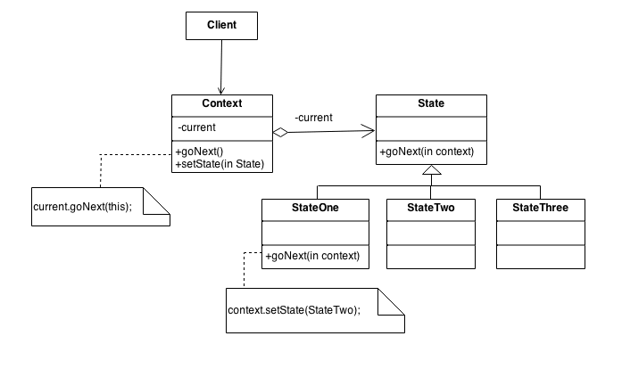

## State Design Pattern
### Intent
* Allow an object to alter its behavior when its internal state changes. The object will appear to change its class.
* An object-oriented state machine
* wrapper + polymorphic wrappee + collaboration
## Problem
A monolithic object's behavior is a function of its state, and it must change its behavior at run-time depending on that state. Or, an application is characterized by large and numerous case statements that vector flow of control based on the state of the application.
### Check list
* Identify an existing class, or create a new class, that will serve as the "state machine" from the client's perspective. That class is the "wrapper" class.
* Create a State base class that replicates the methods of the state machine interface. Each method takes one additional parameter: an instance of the wrapper class. The State base class specifies any useful "default" behavior.
* Create a State derived class for each domain state. These derived classes only override the methods they need to override.
* The wrapper class maintains a "current" State object.
* All client requests to the wrapper class are simply delegated to the current State object, and the wrapper object's this pointer is passed.
* The State methods change the "current" state in the wrapper object as appropriate.

