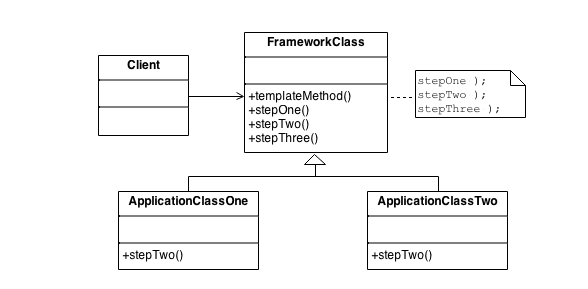

## Template Method Design Pattern
### Intent
* Define the skeleton of an algorithm in an operation, deferring some steps to client subclasses. Template Method lets subclasses redefine certain steps of an algorithm without changing the algorithm's structure.
* Base class declares algorithm 'placeholders', and derived classes implement the placeholders.
### Problem
Two different components have significant similarities, but demonstrate no reuse of common interface or implementation. If a change common to both components becomes necessary, duplicate effort must be expended.
### Check list
* Examine the algorithm, and decide which steps are standard and which steps are peculiar to each of the current classes.
* Define a new abstract base class to host the "don't call us, we'll call you" framework.
* Move the shell of the algorithm (now called the "template method") and the definition of all standard steps to the new base class.
* Define a placeholder or "hook" method in the base class for each step that requires many different implementations. This method can host a default implementation – or – it can be defined as abstract (Java) or pure virtual (C++).
* Invoke the hook method(s) from the template method.
* Each of the existing classes declares an "is-a" relationship to the new abstract base class.
* Remove from the existing classes all the implementation details that have been moved to the base class.
* The only details that will remain in the existing classes will be the implementation details peculiar to each derived class.

