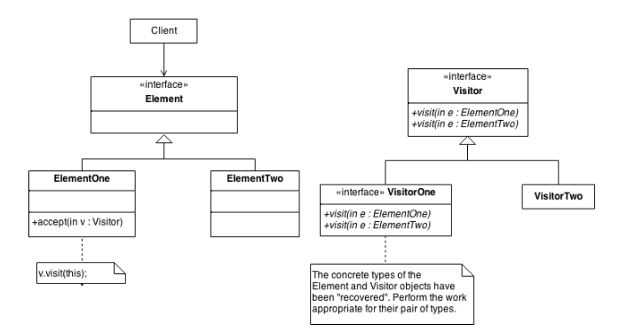

## Visitor Design Pattern
### Intent
* Represent an operation to be performed on the elements of an object structure. Visitor lets you define a new operation without changing the classes of the elements on which it operates.
* The classic technique for recovering lost type information.
* Do the right thing based on the type of two objects.
* Double dispatch
### Problem
Many distinct and unrelated operations need to be performed on node objects in a heterogeneous aggregate structure. You want to avoid "polluting" the node classes with these operations. And, you don't want to have to query the type of each node and cast the pointer to the correct type before performing the desired operation.
### Check list
* Confirm that the current hierarchy (known as the Element hierarchy) will be fairly stable and that the public interface of these classes is sufficient for the access the Visitor classes will require. If these conditions are not met, then the Visitor pattern is not a good match.
* Create a Visitor base class with a visit(ElementXxx) method for each Element derived type.
* Add an accept(Visitor) method to the Element hierarchy. The implementation in each Element derived class is always the same – accept( Visitor v ) { v.visit( this ); }. Because of cyclic dependencies, the declaration of the Element and Visitor classes will need to be interleaved.
* The Element hierarchy is coupled only to the Visitor base class, but the Visitor hierarchy is coupled to each Element derived class. If the stability of the Element hierarchy is low, and the stability of the Visitor hierarchy is high; consider swapping the 'roles' of the two hierarchies.
* Create a Visitor derived class for each "operation" to be performed on Element objects. visit() implementations will rely on the Element's public interface.
* The client creates Visitor objects and passes each to Element objects by calling accept().

  
  
